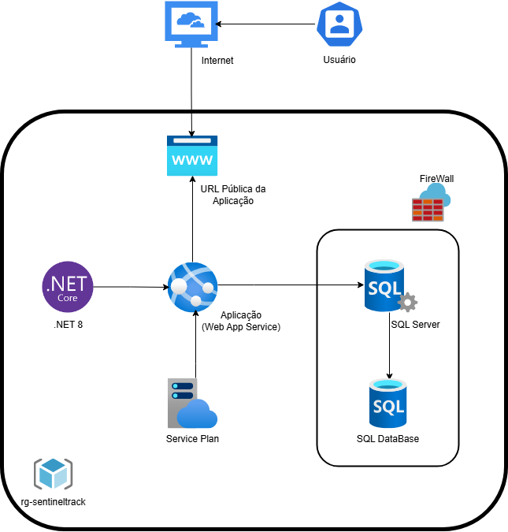

# SafeCap API

**SafeCap** é uma API REST desenvolvida em .NET 8 com Entity Framework Core e banco de dados Oracle, desenvolvida como parte da Global Solution do primeiro semestre de 2025.
Essa API consiste em gerenciar Usuários, Leituras feitas por sensores em nossos SafeCaps (Bonés Inteligentes), e também Alertas baseados nessas leituras.

## Rotas Disponíveis

---

### Usuários (`/api/users`)

- **GET /api/users** — Lista os Usuários, com filtros opcionais via query params:

  | Query Param  | Tipo    | Descrição                                    | Exemplo         |
  |--------------|---------|----------------------------------------------|-----------------|
  | name         | string  | Filtra os usuários pelo nome de usuário      | `/api/users?name=Gabriel` |
  | email        | string  | Filtra os usuários pelo email                | `/api/users?email=gabriel@gmail.com` |

- **GET /api/users/{id}** — Busca usuário pelo ID.

- **POST /api/users** — Cria um novo usuário.

- **PUT /api/users/{id}** — Atualiza um usuário existente.

- **DELETE /api/users/{id}** — Remove um usuário.

---

### Leituras do Sensor (`/api/readings`)

- **GET /api/readings** — Lista as Leituras, com filtros opcionais via query params:

  | Query Param  | Tipo    | Descrição                                    | Exemplo         |
  |--------------|---------|----------------------------------------------|-----------------|
  | userId       | Guid    | Filtra as leituras pelo id do usuário        | `/api/readings?userId=...` |
  | startDate    | DateTime | Filtra as leituras após uma data            | `/api/readings?startDate=2025-06-07` |
  | endDate      | DateTime | Filtra as leituras antes de uma data        | `/api/readings?endDate=2025-06-07` |

- **GET /api/readings/{id}** — Busca leitura pelo ID.

- **POST /api/readings** — Cria uma nova leitura.

- **PUT /api/readings/{id}** — Atualiza uma leitura existente.

- **DELETE /api/readings/{id}** — Remove uma leitura.

---

### Alertas (`/api/alerts`)

- **GET /api/alerts** — Lista os Alertas, com filtros opcionais via query params:

  | Query Param  | Tipo    | Descrição                                    | Exemplo         |
  |--------------|---------|----------------------------------------------|-----------------|
  | userId       | Guid    | Filtra os alertas pelo id do usuário         | `/api/alerts?userId=...` |
  | alertType    | string  | Filtra os alertas pelo tipo de alerta        | `/api/alerts?alertType=LowHumidity` |

- **GET /api/alerts/{id}** — Busca alerta pelo ID.

- **POST /api/alerts** — Cria um novo alerta.

- **PUT /api/alerts/{id}** — Atualiza um alerta existente.

- **DELETE /api/alerts/{id}** — Remove um alerta.

---

## Instruções de Execução

1. Clone o repositório:
   ```bash
   git clone https://github.com/ThomazBartol/SafeCapAPI.git
   cd SafeCapAPI/

2. Crie dentro da pasta SafeCap (no mesmo diretório que o .csproj):
    arquivo .env contendo:
   ```bash
   ORACLE_CONNECTION_STRING=User Id={usuário};Password={senha};Data Source=oracle.fiap.com.br:1521/ORCL

4. Rode o projeto com o comando:
   ```bash
   dotnet run

5. Caso o Swagger não abra sozinho acesse em:
   http://localhost:8080/swagger/index.html

## Comandos e Scripts Testes da API
Na raiz do projeto, você encontrará o arquivo comandos-teste.txt com todos os comandos para testar a API além dos scripts de uso do dockerfile.

## Diagrama de Classes




## 👥 INTEGRANTES DO GRUPO
===========================

- RM555323 - Thomaz Oliveira Vilas Boas Bartol
- RM556089 - Vinicius Souza Carvalho
- RM556972 - Gabriel Duarte Pinto
